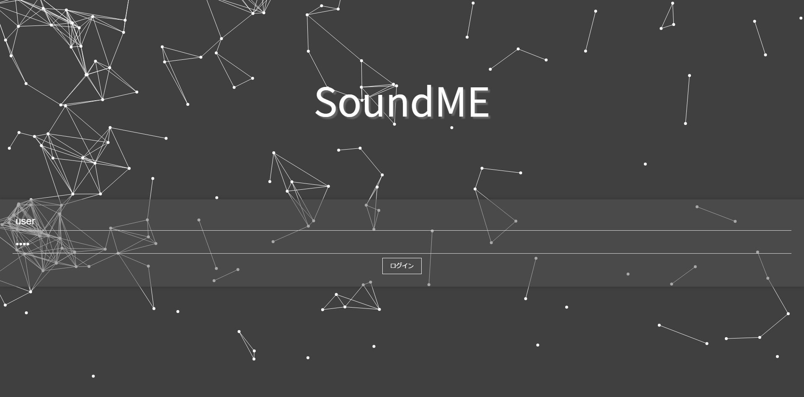
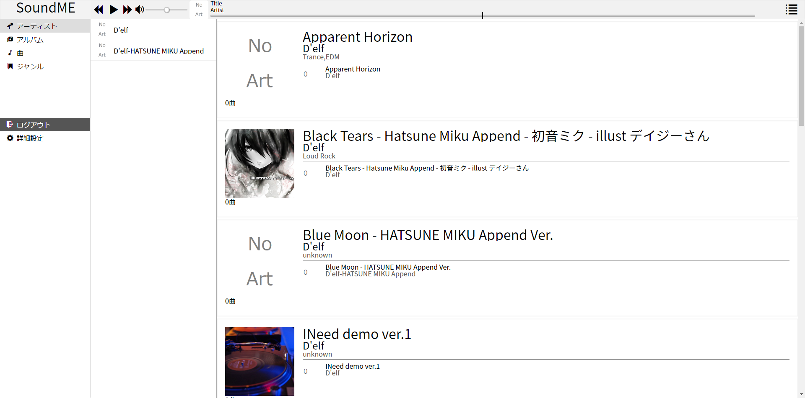
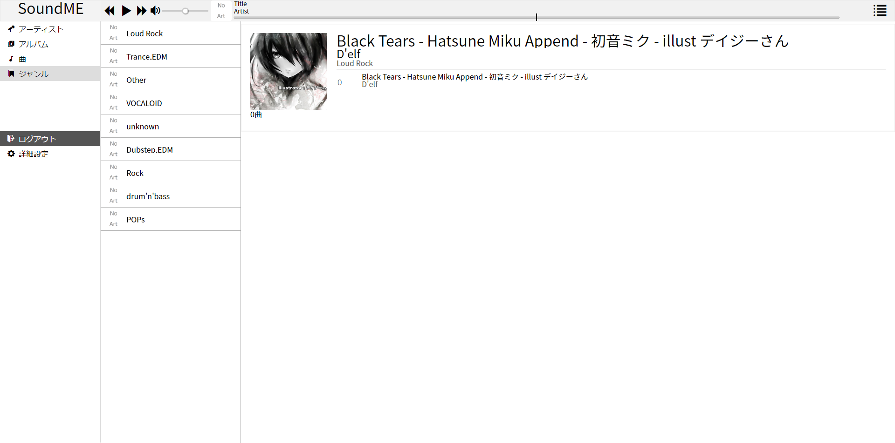
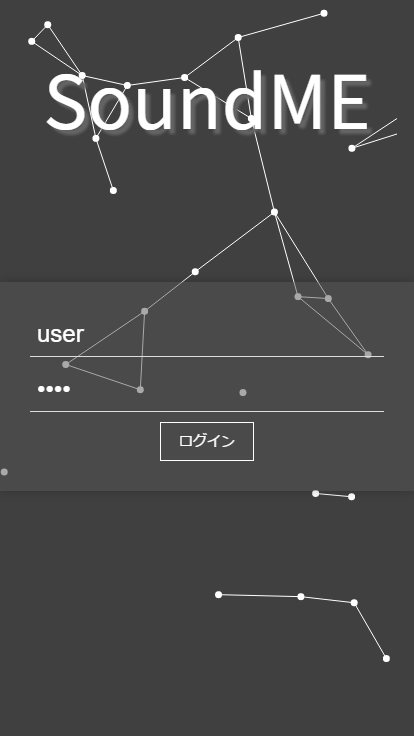
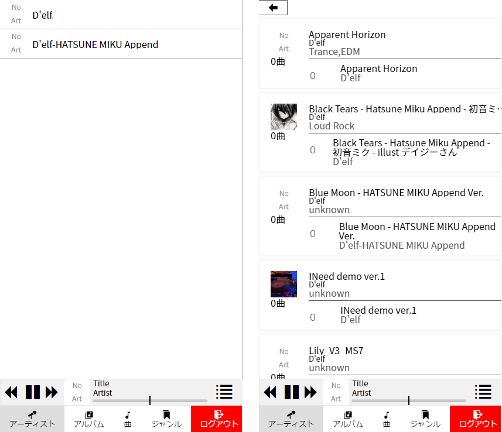
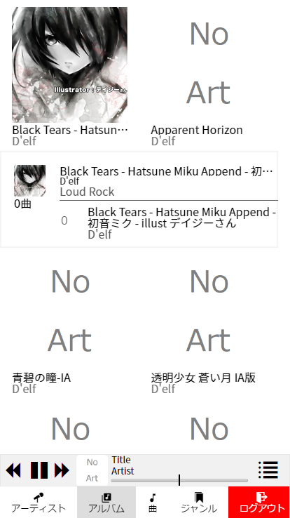
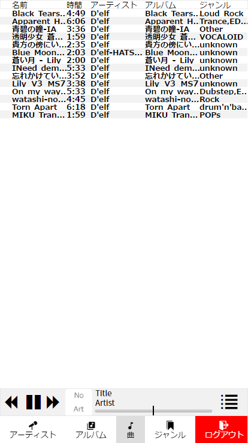
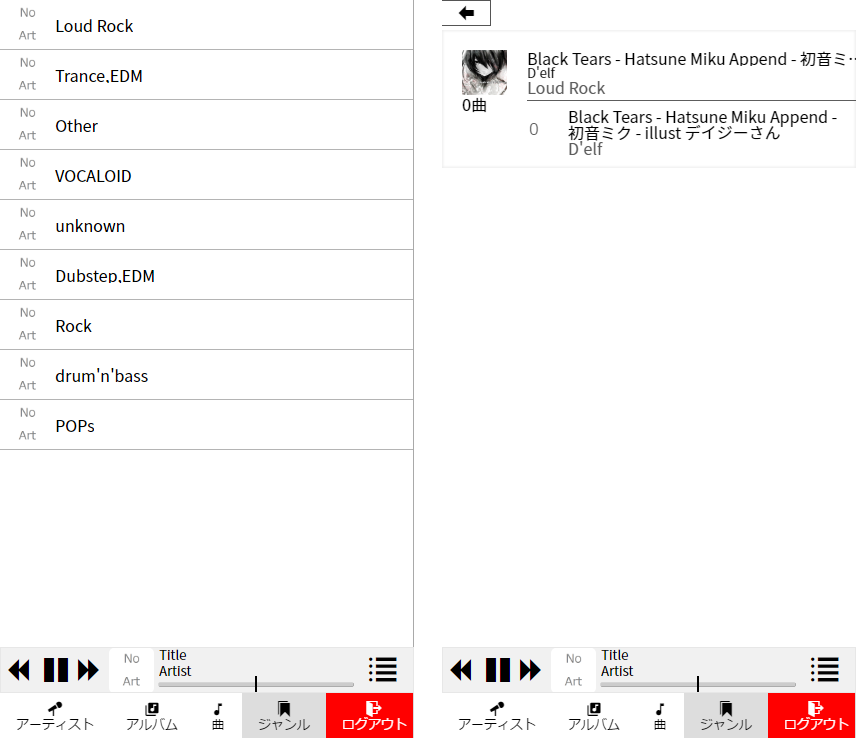
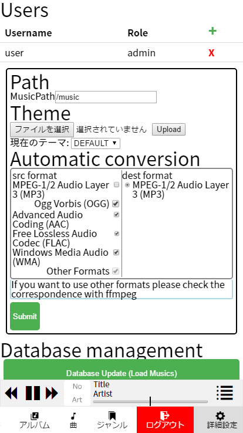

# SoundMeとは
 WebでiTunesみたいの欲しかっただけ
 スマートフォンでは一度ピンチイン操作をしないと動作しない場合があります
 
# どんな感じなの？
   iTunesライクな感じのデザインです  
   [Demo](http://test.magitech.xyz)  <- ちょっと重たいかも

  
デフォルトテーマ

  <ul>
    

      
PC版

      Title
      
      Artists
      
      Albums
      
      Songs
      
      Genres
      
      Settings
      
    

    

      
スマホ版

      Title
      
      Artists
      
      Albums
      
      Songs
      
      Genres
      
      Settings
      
    

  </ul>

   
テーマを自分で作成し使用することも出来ます
 
# 使い方
 マシンにffmpegをインストールしてから
 `npm install`して`npm start`してください
 
 logが見たい場合には`DEBUG=soundme`をつけてください
 
 dockerは[こちら(syuchan1005/soundme)](https://hub.docker.com/r/syuchan1005/soundme/)
 
 adminユーザが存在しないときは自動でアカウントが作成されるのでコンソールを見てください
 