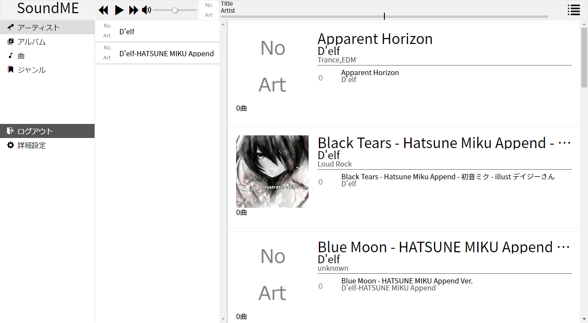
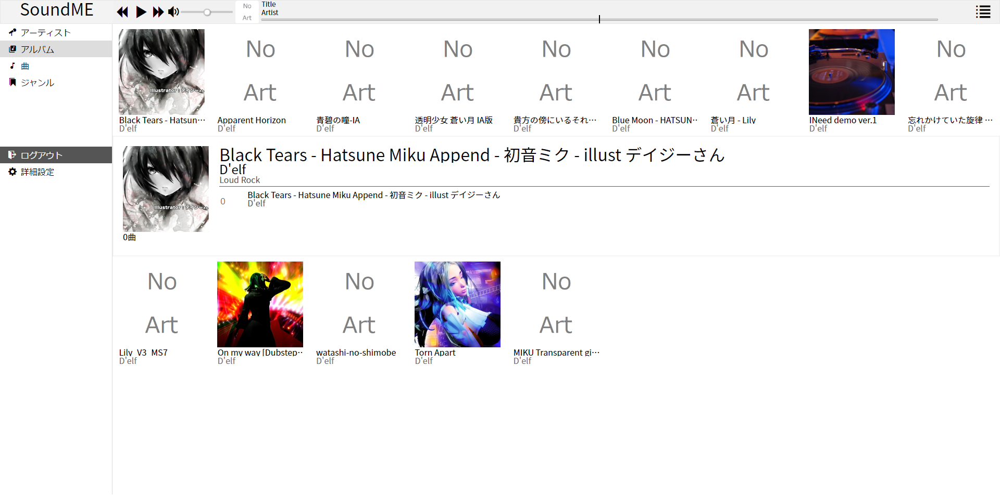
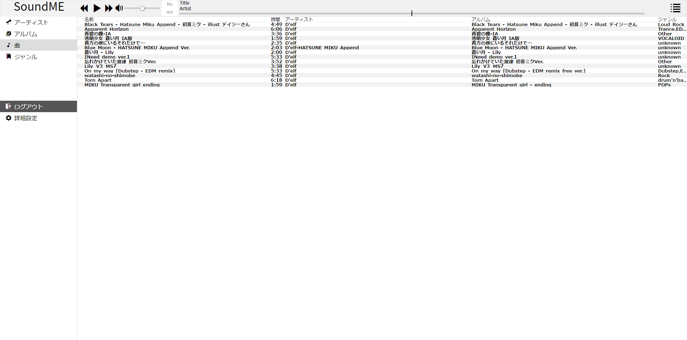
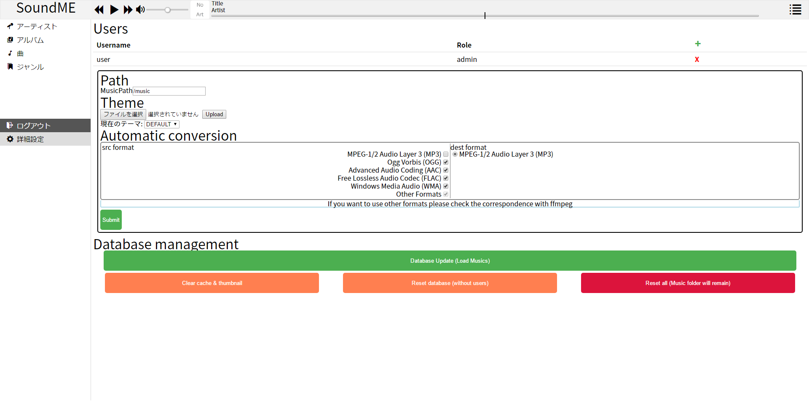

# SoundMeとは
 WebでiTunesみたいの欲しかっただけ
 スマートフォンでは一度ピンチイン操作をしないと動作しない場合があります
 
# どんな感じなの？
   iTunesライクな感じのデザインです  
   [Demo](http://test.magitech.xyz)  <- ちょっと重たいかも


<details> 
 <summary>デフォルトテーマ</summary>
 <span>Artist</span>
 
 <span>Albums</span>
 
 <span>Songs</span>
 
 <span>Settings</span>
 
</details>

   
テーマを自分で作成し使用することも出来ます
 
# 使い方
 `npm install`して`npm start`してください
 
 logが見たい場合には`DEBUG=soundme`をつけてください
 
 初期ユーザーは
 ```text
User: "user"
Pass: "pass"
```
  になっています
 